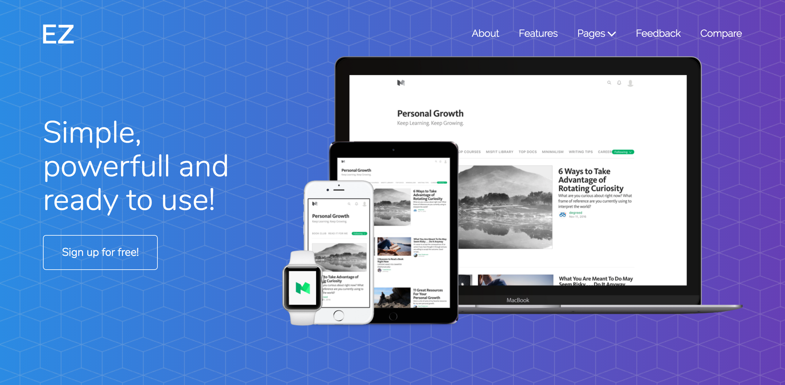
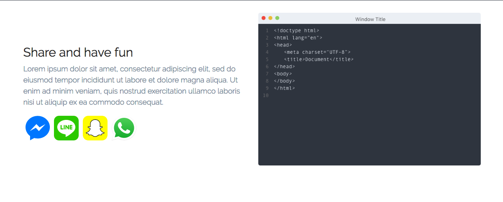

# Introducing

This documentation is made for describing all aspects of development your website using our beautiful theme. We've done everything we can to make this as easy as possible for you.

## Required knowledge

You may learn some basic things at [w3school](http://www.w3schools.com/) and [MDN](https://developer.mozilla.org/).

We're using the following tools to provide you with the best file scructure and an amazing development experience:

- [Mustache](http://mustache.github.io/) as a template engine. Usually we're using it for including components inside the main page. It allows us to build pages easily.
- [Gulp](http://gulpjs.com/) as a tasks runner.
- [Less](http://lesscss.org/) as css pre-processor.

## Getting started

If you already downloaded theme open your project folder and run `npm install` to install project's libraries.

Open your command line and run `gulp` and then `gulp dev`. This command will build the template and open it inside the browser (if not, please open [http://localhost:3000](http://localhost:3000) inside browser).

## Building project for production

When you finished with your project just run `gulp` and your built template will be placed inside `dist` folder. You can upload this folder directly to your hosting via FTP.

## Project file structure
```bash
Elisa template/
|-- components/
|   |-- common/
|   |-- headers/
|   |-- sections/
|-- Docs/
|-- img/
|-- js/
|-- less/
    |-- components/
    |   |-- sections/
    |   |-- ...
    |-- mixins.less
    |-- style.less
    |-- variable.less
```

## Creating Landing Page

To create a new landing page you have to edit `index.mustache` file inside root folder and fill it with components (all components are described below).

To add a new component to your page:

1. Choose component from our library.
2. Insert it to the `index.mustache` page using the following syntax: `{{> components/sections/[component-name] }}`

Yes, this is so easy.

## Configuring your page

### Animations
We have included a subtile animations for elements while scrolling. You can also add the effect to any element by adding the following class and data-* attributes. For example you want to aplly on scroll animations to a <div> element, The final code will look like :

```html
<div class="wow fadeInDown" data-wow-delay="0.1s">
```

This template uses Animate.css plugin for animations. So you have the option to change the effect from any available options on Animate.css Such as fadeInDown , fadeInUp , zoomIn, bounceInDown, bounceInLeft etc. Please note that the Class names are CASE SENSITIVE.


### Turn off Animation
If you don't want to use the onscroll animation, You can simply change the data-scroll-animation to false from the <body> tag.
```html
<!-- Change the data-scroll-animation to false  -->
<body class="home" data-scroll-animation="false">
```


## Components
Here's the list of all components you can choose.

## Navbars

### Navbar dark (default)


**How to include:** `{{> components/common/navbar-dark }}`

**File for HTML customization:** `components/common/navbar-dark.mustache`

**File for Styles customization:** `less/components/navigation.less`

### Navbar light


**How to include:** `{{> components/common/navbar-light }}`

**File for HTML customization:** `components/common/navbar-light.mustache`

**File for Styles customization:** `less/components/navigation.less`

## Footers

### Footer dark (default)


**How to include:** `{{> components/common/footer }}`

**File for HTML customization:** `components/common/footer-light.mustache`

**File for Styles customization:** `less/components/footer.less`

### Footer light


**How to include:** `{{> components/common/footer-light }}`

**File for HTML customization:** `components/common/footer.mustache`

**File for Styles customization:** `less/components/footer.less`

## Headers

Headers are top page component. You can choose one of the following templates and customize it for your needs:

### Image with gradient


**How to include:** `{{> components/headers/image-gradient }}`

**File for HTML customization:** `components/headers/image-gradient.mustache`

**File for Styles customization:** `less/components/header.less` edit `header.general__image-gradient`

Customizable LESS properties:

 Meaning | Variable name  | Where to find? | 
 --- | --- | ---
 Background image url  | `@header-background-image-url`    | `less/components/header.less` line 1  |
 Gradient background start color (bottom left). Default is `@theme-primary`  | `@header-gradient-start-color`    | `less/components/header.less` line 2  |
 Gradient background end color (bottom left). Default is `@theme-secondary`  | `@header-gradient-end-color`    | `less/components/header.less` line 3  |

### Devices on right



SketchApp sources for devices mockups are included in the bundle.

**How to include:** `{{> components/headers/devices-on-right }}`

**File for HTML customization:** `components/headers/devices-on-right.mustache`

**File for Styles customization:** `less/components/header.less` edit `header.devices-on-right`

Customizable LESS properties:

Meaning | Variable name  | Where to find? | 
 --- | --- | ---
 Background pattern url  | `@header-background-pattern-url`    | `less/components/header.less` line 4  |
 Gradient background start color (bottom left). Default is `@theme-primary`  | `@header-gradient-start-color`    | `less/components/header.less` line 2  |
 Gradient background end color (bottom left). Default is `@theme-secondary`  | `@header-gradient-end-color`    | `less/components/header.less` line 3  |


### Bottom laptop


**How to include:** `{{> components/headers/bottom-laptop }}`

**File for HTML customization:** `components/headers/bottom-laptop.mustache`

**File for Styles customization:** `less/components/header.less` edit `header.bottom-laptop`

Customizable LESS properties:

Meaning | Variable name  | Where to find? | 
 --- | --- | ---
 Gradient background start color (bottom left). Default is `@theme-primary`  | `@header-gradient-start-color`    | `less/components/header.less` line 2  |
 Gradient background end color (bottom left). Default is `@theme-secondary`  | `@header-gradient-end-color`    | `less/components/header.less` line 3  |


### Mobile on Right


**How to include:** `{{> components/headers/mobile-on-right }}`

**File for HTML customization:** `components/headers/mobile-on-right.mustache`

**File for Styles customization:** `less/components/header.less` edit `header.mobile-on-right`

Customizable LESS properties:

Meaning | Variable name  | Where to find? | 
 --- | --- | ---
 Gradient background start color (bottom left). Default is `@theme-primary`  | `@header-gradient-start-color`    | `less/components/header.less` line 2  |
 Gradient background end color (bottom left). Default is `@theme-secondary`  | `@header-gradient-end-color`    | `less/components/header.less` line 3  |


### Mobile devices on right


**How to include:** `{{> components/headers/mobile-on-right-small }}`

**File for HTML customization:** `components/headers/mobile-on-right-small.mustache`

**File for Styles customization:** `less/components/header.less` edit `header.mobile-on-right-small`

Customizable LESS properties:

Meaning | Variable name  | Where to find? | 
 --- | --- | ---
 Gradient background start color (bottom left). Default is `@theme-primary`  | `@header-gradient-start-color`    | `less/components/header.less` line 2  |
 Gradient background end color (bottom left). Default is `@theme-secondary`  | `@header-gradient-end-color`    | `less/components/header.less` line 3  |


### Video on right


**How to include:** `{{> components/headers/video-on-right }}`

**File for HTML customization:** `components/headers/video-on-right.mustache`

**File for Styles customization:** `less/components/header.less` edit `header.video-on-right`

Customizable LESS properties:

Meaning | Variable name  | Where to find? | 
 --- | --- | ---
 Gradient background start color (bottom left). Default is `@theme-primary`  | `@header-gradient-start-color`    | `less/components/header.less` line 2  |
 Gradient background end color (bottom left). Default is `@theme-secondary`  | `@header-gradient-end-color`    | `less/components/header.less` line 3  |

## Features sections

### 2 Features


**How to include:** `{{> components/sections/2-features }}`

**File for HTML customization:** `components/sections/2-features.mustache`

**File for Styles customization:** `less/components/sections/features-2.less`


### 3 Features


**How to include:** `{{> components/sections/3-features }}`

**File for HTML customization:** `components/sections/3-features.mustache`

**File for Styles customization:** `less/components/sections/features.less`

### 6 Features


**How to include:** `{{> components/sections/6-features }}`

**File for HTML customization:** `components/sections/6-features.mustache`

**File for Styles customization:** `less/components/sections/features.less`

### 6 Features with top images


**How to include:** `{{> components/sections/6-features-top }}`

**File for HTML customization:** `components/sections/6-features-top.mustache`

**File for Styles customization:** `less/components/sections/features.less`

## Contact us

### Contact with a map


**How to include:** `{{> components/sections/contact-with-map }}`

**File for HTML customization:** `components/sections/contact-with-map.mustache`

**File for Styles customization:** `less/components/sections/contact-with-map.less`

### Contact with a text


**How to include:** `{{> components/sections/contact-default }}`

**File for HTML customization:** `components/sections/contact-default.mustache`

**File for Styles customization:** `less/components/sections/contact-default.less`


## Split sections

### Dark blog


**How to include:** `{{> components/sections/blog-1 }}`

**File for HTML customization:** `components/sections/blog-1.mustache`

**File for Styles customization:** `less/components/sections/blog-row-1.less`

### Fullscreen split


**How to include:** `{{> components/sections/split-fullscreen }}`

**File for HTML customization:** `components/sections/split-fullscreen.mustache`

**File for Styles customization:** `less/components/sections/split-fullscreen.less`

## Splashs

### Default splash


**How to include:** `{{> components/sections/splash-default }}`

**File for HTML customization:** `components/sections/splash-default.mustache`

**File for Styles customization:** `less/components/sections/splash.less`

### Light splash


**How to include:** `{{> components/sections/splash-light }}`

**File for HTML customization:** `components/sections/splash-light.mustache`

**File for Styles customization:** `less/components/sections/splash.less`

### Dark splash


**How to include:** `{{> components/sections/splash-dark }}`

**File for HTML customization:** `components/sections/splash-dark.mustache`

**File for Styles customization:** `less/components/sections/splash.less`

## Newsletter signups

### Default newsletter


**How to include:** `{{> components/sections/newsletter }}`

**File for HTML customization:** `components/sections/newsletter.mustache`

**File for Styles customization:** `less/components/sections/newsletter.less`

## Testimonials

### Default testimonials


**How to include:** `{{> components/sections/testimonials-default }}`

**File for HTML customization:** `components/sections/testimonials-default.mustache`

**File for Styles customization:** `less/components/sections/testimonials.less`

### Quotes testimonials


**How to include:** `{{> components/sections/testimonials-quotes }}`

**File for HTML customization:** `components/sections/testimonials-quotes.mustache`

**File for Styles customization:** `less/components/sections/testimonials.less`

## Sections

### Team


**How to include:** `{{> components/sections/team }}`

**File for HTML customization:** `components/sections/team.mustache`

**File for Styles customization:** `less/components/sections/team.less`

### App Download


**How to include:** `{{> components/sections/download-section }}`

**File for HTML customization:** `components/sections/download-section.mustache`

**File for Styles customization:** `less/components/sections/download-section.less`

### Split feature



**How to include:** `{{> components/sections/dsplit-feature-1 }}`

**File for HTML customization:** `components/sections/split-feature-1.mustache`

**File for Styles customization:** `less/components/sections/split-feature-1.less`
